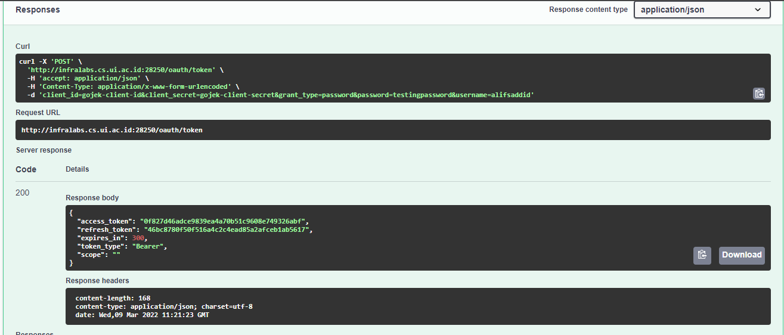
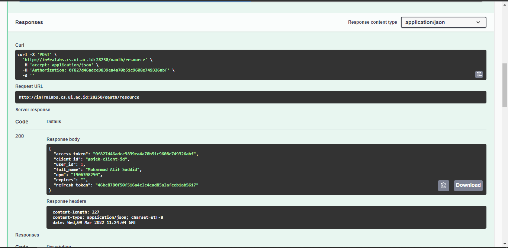

# Tugas Mandiri 1 - LAW 2022

Nama: Muhammad Alif Saddid

NPM: 1906398250


# URL

http://infralabs.cs.ui.ac.id:28250/swagger/index.html

## [`/oauth/token`](http://infralabs.cs.ui.ac.id:28250/oauth/token)

Menggunakan swagger tersebut, dapat dicoba akses melalui endpoint `/oauth/token` dengan data berikut:

```
client_id: gojek-client-id
client_secret: gojek-client-secret
grant_type: password
username: alifsaddid
password: testingpassword
```

Atau menggunakan curl command berikut:

```
curl -X 'POST' \
  'http://infralabs.cs.ui.ac.id:28250/oauth/token' \
  -H 'accept: application/json' \
  -H 'Content-Type: application/x-www-form-urlencoded' \
  -d 'client_id=gojek-client-id&client_secret=gojek-client-secret&grant_type=password&password=testingpassword&username=alifsaddid'
```

Sementara pada database baru terdaftar client dengan id `gojek-client-id` dan secret `gojek-client-secret`. Jika menggunakan selain itu, maka proses autentikasi gagal.

Sementara pada database baru terdaftar user dengan username `alifsaddid` dan password `testingpassword`. Jika menggunakan selain itu, maka proses autentikasi gagal.

## [`/oauth/resource`](http://infralabs.cs.ui.ac.id:28250/oauth/resource)

Untuk mengakses resource, bisa menggunakan endpoint `/oauth/resource` dengan mengirimkan access token yang sudah didapat.

Contoh curl command:
```
curl -X 'POST' \
  'http://infralabs.cs.ui.ac.id:28250/oauth/resource' \
  -H 'accept: application/json' \
  -H 'Authorization: 0f827d46adce9839ea4a70b51c9608e749326abf' \
  -d ''
```

# Screenshots

## `/oauth/token`



## `/oauth/resource`

